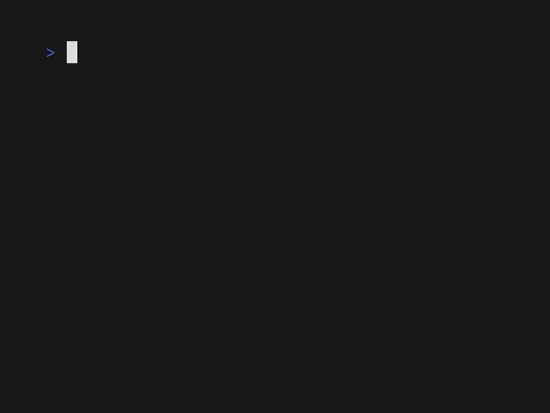

# Development tools for the ZX Spectrum v4.0

The Dockerfile is the basis of the devcontainer and can be changed to add or remove tools. It will take a long time to build locally, so by default the devcontainer will pull a prebuilt version. Edit `.devcontainer/devcontainer.json` if you would rather build your own.

The devcontainer contains:
- pasmo version 0.5.3 (assembler)
- sjasmplus version 1.21.0 (assembler)
- z80asm version 1.8 (assembler)
- z80dasm version 1.1.6 (disassembler)
- zmakebas version 1.2b (creates BASIC programs)
- z88dk version 2.4 (C compiler and other utilities including assembler)
- utilities from the FUSE emulator version 1.4.3:
    - audio2tape
    - createhdf
    - fmfconv
    - listbasic
    - profile2map
    - raw2hdf
    - rzxcheck
    - rzxdump
    - rzxtool
    - scl2trd
    - snap2tzx
    - snapconv
    - snapdump
    - tape2pulses
    - tape2wav
    - tapeconv
    - tzxlist
- zx0 (binary compressor)
- dzx0 (binary decompressor)
- ZX BASIC (aka Boriel BASIC) version 1.18.4
    - zxbc (BASIC compiler)
    - zxbasm (assembler)
    - zxbpp (preprocessor)
    - various tools including nextcreator.py to build .nex files
- ttttt (converts binaries into .tap blocks)
- inpaws version 1.0.2 (interactive fiction compiler/extractor for Gilsoft's PAW)
- skoolkit version 9.6 (tools for creating browseable disassemblies of Spectrum games)
    - sna2ctl.py
    - sna2skool.py
    - skool2html.py
    - skool2asm.py
    - skool2ctl.py
    - skool2bin.py
    - tap2sna.py
    - snapinfo.py
    - trace.py
    - rzxplay.py
    - tapinfo.py
    - rzxinfo.py
    - bin2tap.py
    - bin2sna.py
    - snapmod.py
    - sna2img.py
- pasta80 version 0.96 (PASCAL compiler)
- hdfmonkey version 0.4 (for manipulating sdcard files for the Spectrum Next)
- git (version control)
- make (build control)

Several useful VSCode extentsions will be installed, including a Z80 assembly language server, Z80 and C debugger, Makefile support, BASIC syntax highlighter and more.

Thanks to the many authors of these wonderful tools and extensions; to think what we could have made with these in 1985!

## Breaking changes from v3.x

Boriel BASIC (zxbasic) has been updated. There have been further bug fixes to array referencing which may break old code reliant on previous behaviour.

## New additions from v2.x

The `pasta80` PASCAL compiler has been added. Example code is in `/opt/pasta80/examples`. Invoke the compiler by running `pasta`. A fun feature is that it can run in an IDE mode with vscode integration by running `pasta --ide`!

`hdfmonkey` is a useful tool for manipulating the sdcard images needed for the Spectrum Next and its emulators.

## Install

This devcontainer should work in Windows, Linux and MacOS. It is recommended to install:
- git, then configure user name and email address
- docker, or alternative like podman
- (Windows only, optional) Windows Subsystem for Linux, version 2
- Microsoft's vscode
- the "Dev Containers" extension (from Microsoft) within vscode

Make sure docker (or your alternative) is running before trying to use the devcontainer.

## Usage

Open a terminal and navigate to the directory which will contain your Spectrum projects. Run `git clone https://github.com/mcphail/speccydev.git your_project_name` and enter that directory. Start vscode by running `code .` inside the directory.

If you have installed the Dev Containers extension correctly, a popup will offer to reload the project within a devcontainer. Go ahead and allow this. The first time you use this devcontainer, it may take a few minutes to download and start. It should open more quickly on subsequent use.

Open the bottom bar in vscode to expose the terminal or select "Terminal -> New Terminal" from the menu bar. Try running some Linux commands like `ls -lh` or `date`. Build the example project by running `make` from the terminal or the VSCode extension. Experiment with editing some of the source files and running `make` again. Experiment with some of the assemblers, compilers and other tools mentioned above. The `Makefile` contains example usage of tools like sjasmplus, zmakebas, Boriel's BASIC and the FUSE utilities.

When you are ready to start your own project, run `make start_new_project` to wipe out the example code and start afresh.

## Versions

This `main` branch of this repository will always point to the latest numbered release of the devcontainer image. This image will contain specific, numbered releases of the various tools as documented above. If the devcontainer is updated with non-breaking changes, the minor version number will be incremented. This gives reassurance that, say, a v1.7 devcontainer will contain tools which can compile programs made with a v1.2 devcontainer without issue.

If there is a breaking change in the tools, the major version number will be incremented. So a v2.0 devcontainer may not build projects made in a v1.7 devcontainer correctly. Please ensure all your collaborators are using appropriate devcontainer versions.

## Debugging

Debug in the built in simulator or in CSpect externally (example CSpect invocation on Windows would be `CSpect.exe -w2 -debug -remote`). The simulator is set up to expect a binary called `myprog.sna` and a map file called `myprog.sld` but this can be configured in the `.vscode/launch.json` file.

*Note: to use CSpect debugging from a Linux host you will have to edit the file `.vscode/launch.json` to change the `"hostname"` parameter to `"localhost"`*

## Licences

pamso - copyright Julián Albo and released under the GPL

sjasmplus - copyright aprisobal and released under BSD 3-clause

z80asm - copyright Bas Wijnen and released under GPL v3 or later

z80dasm - copyright Jan Panteltje and Tomaz Solc and released under GPL v2

zmakebas - placed under Public Domain by Russell Marks

z88dk - copyright the z88dk authors and released under the Clarified Artistic License

FUSE utilities - copyright Philip Kendall and contributors and released under GPL v2

zx0 and dzx0 - copyright Einar Saukas and released under BSD 3-clause

Boriel BASIC - copyleft Jose Rodriguez-Rosa and released under AGPL v3 and portions under MIT

ttttt - placed under Public Domain by Neil McPhail

inpaws - copyright "Mastodon" and released under GPL v3

skoolkit - copyright Richard Dymond and Philip M Anderson and released under GPL v3 or later

hdfmonkey - copyright Matt Westcott and released under GPL v3

PASTA/80 - copyright Jörg Pleumann and released under GPL v3 with linking exception
